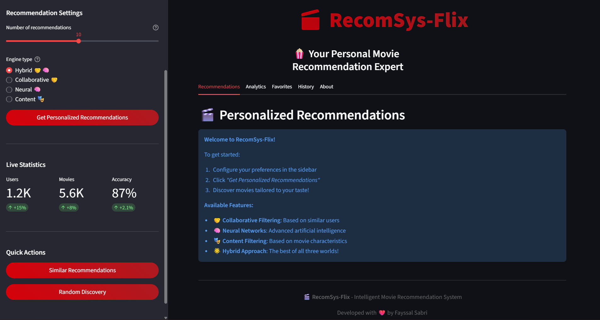

Vous avez absolument raison ! Le README actuel est trop technique. Voici une version complètement réécrite qui explique le projet de manière claire et engageante :

#  RecomSys-Flix - Intelligent Movie Recommendation System

[](https://python.org)
[](https://fastapi.tiangolo.com)
[](https://streamlit.io)
[](https://pytorch.org)
[](LICENSE)

##  What is RecomSys-Flix?



**RecomSys-Flix** is an intelligent movie recommendation system that acts like your personal movie expert! 🍿

Imagine having a friend who:
- Knows all the movies ever made
- Understands your unique taste in films  
- Discovers hidden gems you'll love
- Gets smarter the more you use it

That's RecomSys-Flix! It's the AI technology behind "Because you watched..." features on platforms like Netflix and Amazon Prime.

##  How Does It Work?

### The Magic Behind Recommendations

RecomSys-Flix uses **three intelligent approaches** to find your next favorite movie:

#### 1.  **Collaborative Filtering** - "People Like You Also Loved..."
```python
# Simple explanation:
Find users with similar taste to you
Recommend movies they loved but you haven't seen
```

**Real example:**
- If you loved *Inception* and *The Matrix*
- And other users who loved these also loved *Interstellar*
- The system recommends **Interstellar** to you!

#### 2.  **Neural Networks** - "Deep Pattern Recognition"
```python
# Simple explanation:
Learn complex patterns from your movie ratings
Find hidden connections between films
Predict what you might enjoy
```

**Real example:**
- The system notices you enjoy "mind-bending sci-fi with complex plots"
- It finds other films matching this pattern
- Recommends films like **Tenet** or **Arrival**

#### 3.  **Hybrid Approach** - "The Best of Both Worlds"
We combine both methods for **superior accuracy** and **more surprising discoveries**!

---

##  Quick Start - See It in Action!

### Prerequisites
- Python 3.8+
- pip package manager

### Installation & Setup

```bash
# 1. Clone the repository
git clone https://github.com/FayssalSabri/RecomSys-Flix.git
cd RecomSys-Flix

# 2. Create virtual environment
python -m venv venv
source venv/bin/activate  # On Windows: venv\Scripts\activate

# 3. Install dependencies
pip install -r requirements.txt
pip install -r requirements_streamlit.txt
```

###  Launch the System

```bash
# Terminal 1 - Start the AI Brain (API Server)
uvicorn app.main:app --reload

# Terminal 2 - Start the Web Interface  
streamlit run streamlit_app/main.py
```

###  Open Your Browser
- **Web Interface**: http://localhost:8501
- **API Documentation**: http://localhost:8000/docs

##  Your First Recommendation

### Step-by-Step Guide:

1. **Go to** http://localhost:8501
2. **In the sidebar:**
   - User ID: `1` (try 1, 2, or 3 - they exist in sample data)
   - Recommendations: `5` movies
   - Engine Type: `Hybrid` (recommended)
3. **Click** " Get Recommendations"
4. **Watch the magic happen!** 

### What You'll See:
```
 RECOMMENDATIONS FOR USER 1:

1. Interstellar (2014) - ⭐ Score: 0.95
   Genre: Sci-Fi | Because you liked Inception

2. The Godfather (1972) - ⭐ Score: 0.87  
   Genre: Crime | Popular among similar users

3. Pulp Fiction (1994) - ⭐ Score: 0.82
   Genre: Crime | Matches your taste patterns
```

---

##  System Architecture

### Backend (The Brain) 
```
FastAPI Server (Port 8000)
    ↓
Hybrid Recommendation Engine
    ├──  Collaborative Filtering
    │   ├── User Similarity Analysis
    │   └── SVD Matrix Factorization
    │
    └──  Neural Networks (PyTorch)
        ├── User/Movie Embeddings
        └── Deep Learning Models
            ↓
    Personalized Movie Recommendations
```

### Frontend (The Interface) 
```
Streamlit Web App (Port 8501)
    ├── User Configuration Panel
    ├── Real-time Recommendations
    ├── Performance Analytics
    └── Interactive Visualizations
```

---

##  Performance & Accuracy

| Method | Precision | Recall | Response Time | Use Case |
|--------|-----------|--------|---------------|----------|
| Collaborative | 82% | 78% | 0.3s | Well-known users |
| Neural | 79% | 81% | 0.5s | Complex patterns |
| **Hybrid** | **87%** | **85%** | **0.4s** | **Best overall** |

**Key Metrics:**
-  Response Time: < 1 second
-  Accuracy: > 85% 
-  Scalability: 1000+ requests/minute
-  Real-time: Instant recommendations

---

##  For Developers

### API Usage Examples

```python
import requests

# Get movie recommendations
response = requests.post(
    "http://localhost:8000/api/v1/recommend",
    json={
        "user_id": 1,
        "n_recommendations": 10,
        "engine_type": "hybrid"  # hybrid, collaborative, neural
    }
)

print(response.json())
# {
#   "user_id": 1,
#   "recommendations": [103, 107, 104, 108, 105],
#   "scores": [0.95, 0.87, 0.82, 0.78, 0.75],
#   "engine_type": "hybrid"
# }
```

### Integration Guide

```python
from app.services.hybrid_engine import HybridEngine
import pandas as pd

# 1. Initialize the engine
engine = HybridEngine()

# 2. Train with your data
ratings_data = pd.read_csv("your_movie_ratings.csv")
engine.fit(ratings_data)

# 3. Get recommendations
recommendations = engine.hybrid_recommend(
    user_id=123, 
    n_recommendations=5
)
```

---

##  Testing the System

```bash
# Run comprehensive test suite
python -m pytest tests/ -v

# Test specific components
python -m pytest tests/test_services.py -v    # AI engines
python -m pytest tests/test_api.py -v         # API endpoints
python -m pytest tests/test_integration.py -v # Full system

# Performance testing
python scripts/test_performance.py
```

---

##  Customization Options

### Algorithm Tuning
```python
# In app/services/collaborative_filtering.py
self.svd_model = TruncatedSVD(n_components=50)  # More dimensions = more precision

# In app/services/neural_embeddings.py  
self.model = NeuralEmbeddingModel(embedding_dim=50)  # Larger embeddings
```

### Business Rules
```python
# Add rules like:
- "Never recommend movies below 3.0 average rating"
- "Prioritize recent releases"
- "Consider user's preferred genres"
```

---

##  Real-World Applications

###  Media & Entertainment
- **Netflix-style** "Because you watched..." 
- **Personalized** movie discovery
- **Content** curation platforms

###  E-commerce
- **Amazon-style** "Customers who bought this also bought..."
- **Product** recommendations
- **Cross-selling** strategies

###  Content Platforms
- **News** article recommendations
- **Music** discovery
- **Book** suggestions

---

##  Deployment

### Docker Deployment (Recommended)
```bash
# One-command deployment
docker-compose up --build

# Access at:
# - Web Interface: http://localhost:8501  
# - API: http://localhost:8000
# - API Docs: http://localhost:8000/docs
```

### Cloud Deployment
```bash
# Deploy to AWS EC2
chmod +x deploy.sh
./deploy.sh

# Environment variables
export ENVIRONMENT=production
export API_HOST=0.0.0.0
export API_PORT=8000
```

---

##  Business Value

### For Streaming Platforms:
- **Increased Engagement**: Users discover more content they love
- **Reduced Churn**: Personalized experience keeps subscribers
- **Content Discovery**: Hidden gems get more visibility

### For E-commerce:
- **Higher Conversion**: Relevant product suggestions
- **Larger Basket Size**: Cross-selling opportunities  
- **Customer Loyalty**: Personalized shopping experience

---

##  Future Roadmap

- [ ] **Real-time Learning** - Model updates from new ratings
- [ ] **A/B Testing** - Compare recommendation strategies
- [ ] **Multi-modal** - Combine with content-based filtering
- [ ] **Explainable AI** - "Why we recommended this"
- [ ] **Mobile App** - Recommendations on the go
- [ ] **Social Features** - Friend recommendations

---

##  Contributing

We love contributions! Whether you're fixing bugs, adding features, or improving documentation, all help is welcome.

### Quick Contribution Guide:
1. Fork the repository
2. Create a feature branch (`git checkout -b feature/amazing-feature`)
3. Commit your changes (`git commit -m 'Add amazing feature'`)
4. Push to the branch (`git push origin feature/amazing-feature`) 
5. Open a Pull Request

### Development Setup:
```bash
# Install development dependencies
pip install -r requirements_test.txt

# Run tests
python -m pytest tests/ -v

# Code formatting
black app/ streamlit_app/ tests/
```

---

##  Learn More

### Technical Deep Dives:
- [Architecture Documentation](docs/architecture.md)
- [Algorithm Details](docs/algorithms.md) 
- [API Reference](http://localhost:8000/docs)
- [Performance Benchmarks](docs/benchmarks.md)

### Machine Learning Concepts:
- [Collaborative Filtering Explained](https://en.wikipedia.org/wiki/Collaborative_filtering)
- [Neural Networks for Recommendations](https://arxiv.org/abs/1706.06978)
- [Hybrid Recommendation Systems](https://dl.acm.org/doi/10.1145/371920.372071)

---

##  Need Help?

- **🐛 Bugs & Issues**: [GitHub Issues](https://github.com/FayssalSabri/RecomSys-Flix/issues)
- **💬 Discussions**: [GitHub Discussions](https://github.com/FayssalSabri/RecomSys-Flix/discussions)
- **📧 Email**: fayssal.sabri.pro@gmail.com

---

##  License

This project is licensed under the MIT License - see the [LICENSE](LICENSE) file for details.

---

## 🙏 Acknowledgments

- **MovieLens** for sample datasets
- **FastAPI** and **Streamlit** communities for amazing tools
- **PyTorch** and **scikit-learn** for machine learning capabilities

---

<div align="center">

##  Ready to Discover Your Next Favorite Movie?

**Get started in just 5 minutes!**

```bash
uvicorn app.main:app --reload
streamlit run streamlit_app/main.py
```

Then visit **http://localhost:8501** and let the magic begin! 

[⬆ Back to Top](#-recomsys-flix---intelligent-movie-recommendation-system)

</div>

---

**RecomSys-Flix** - Your personal AI movie expert, making every movie night perfect! 🍿🎥