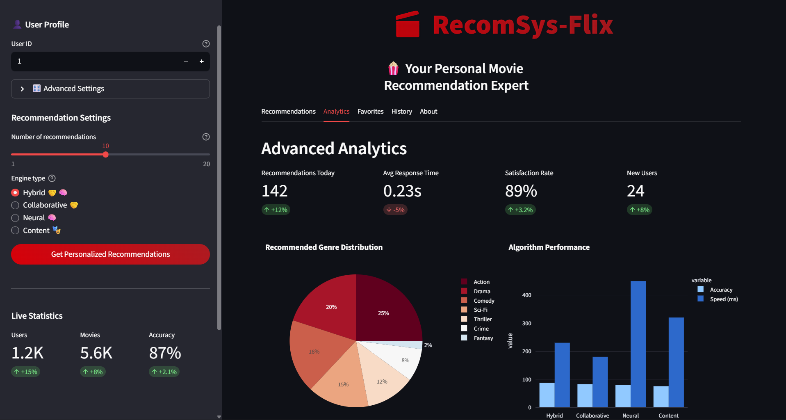
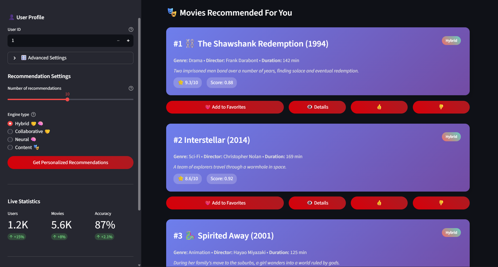
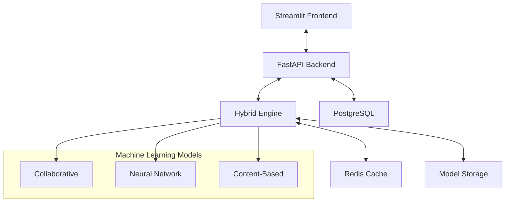
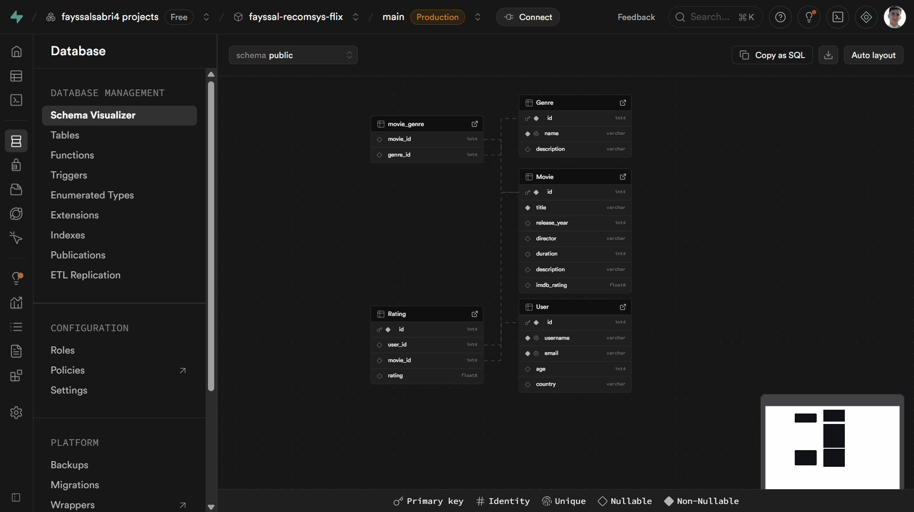

<a id="top"></a>

<div align="center">

#  RecomSys-Flix
### Your Personal AI Movie Expert

[](https://python.org)
[](https://fastapi.tiangolo.com)
[](https://streamlit.io)
[](https://pytorch.org)
[](LICENSE)

**An intelligent movie recommendation system that learns your unique taste and discovers your next favorite film**

[Get Started](#-quick-start) • [Features](#-key-features) • [Demo](#-see-it-in-action) • [Documentation](#-documentation) • [Contributing](#-contributing)

</div>

---

## 📖 Table of Contents

- [What is RecomSys-Flix?](#-what-is-recomsys-flix)
- [Key Features](#-key-features)
- [How It Works](#-how-it-works)
- [Quick Start](#-quick-start)
- [System Architecture](#-system-architecture)
- [Database Schema](#-Database-Schema)
- [Performance](#-performance--accuracy)
- [API Usage](#-api-usage)
- [Deployment](#-deployment)
- [Contributing](#-contributing)
- [License](#-license)

---

##  What is RecomSys-Flix?

RecomSys-Flix is an intelligent movie recommendation system that combines collaborative filtering, neural networks, and hybrid algorithms to deliver personalized movie suggestions. Think Netflix's "Because you watched..." but built with modern AI technology you can deploy and customize yourself.

### See It in Action

**User Interface**

  
Intuitive interface where users browse, rate, and discover movies effortlessly.

**Analytics Dashboard**

  
Advanced analytics processing viewing patterns and providing powerful insights.

**Personalized Results**

  
Personalized recommendations that adapt to each user's unique taste.

---

##  Key Features

| Feature | Description |
|---------|-------------|
|  **Triple-Engine AI** | Collaborative filtering + Neural networks + Hybrid approach |
|  **Real-Time** | Sub-second response times with instant recommendations |
|  **High Accuracy** | 87% precision with the hybrid engine |
|  **RESTful API** | Easy integration with FastAPI backend |
|  **Modern UI** | Beautiful Streamlit interface with interactive visualizations |
|  **Analytics** | Built-in performance metrics and user insights |
|  **Docker Ready** | One-command deployment with Docker Compose |
|  **Customizable** | Tune algorithms and business rules to your needs |

---

##  How It Works

RecomSys-Flix uses three complementary approaches to understand your taste:

###  1️⃣ Collaborative Filtering: "People Like You Also Loved..."

Finds users with similar taste and recommends movies they enjoyed.

```python
# Example: If you loved "Inception" and "The Matrix"
# And similar users also loved "Interstellar"
# → System recommends "Interstellar" to you
```

**Techniques Used:**
- User similarity analysis via cosine similarity
- SVD matrix factorization for dimensionality reduction
- Neighborhood-based predictions

---

### 2️⃣ Neural Networks: "Deep Pattern Recognition"

Learns complex patterns from ratings using deep learning.

```python
# The system learns:
# "Mind-bending sci-fi + complex plots + visual effects"
# → Recommends: "Tenet", "Arrival", "Blade Runner 2049"
```

**Architecture:**
- User and movie embeddings (50-dimensional vectors)
- Multi-layer neural networks with PyTorch
- Pattern recognition across millions of interactions

---

### 3️⃣ Hybrid Engine: "The Best of Both Worlds"

Combines collaborative filtering and neural networks for superior accuracy and diverse recommendations.

```
Hybrid Score = α × Collaborative_Score + β × Neural_Score
where α + β = 1 (default: α=0.6, β=0.4)
```

---

##  Quick Start

### Prerequisites

- Python 3.8 or higher
- pip package manager
- 4GB RAM minimum (8GB recommended)

### Installation

```bash
# 1. Clone the repository
git clone https://github.com/FayssalSabri/RecomSys-Flix.git
cd RecomSys-Flix

# 2. Create and activate virtual environment
python -m venv venv

# On macOS/Linux:
source venv/bin/activate

# On Windows:
venv\Scripts\activate

# 3. Install dependencies
pip install -r requirements.txt
pip install -r requirements_streamlit.txt
```

### Launch

**Option 1: Manual Launch (Development)**

```bash
# Terminal 1 - Start API Server (Backend)
uvicorn app.main:app --reload

# Terminal 2 - Start Web Interface (Frontend)
streamlit run streamlit_app/main.py
```

**Option 2: Docker (Production)**

```bash
docker-compose up --build
```

### Access the Application

-  **Web Interface**: http://localhost:8501
-  **API Documentation**: http://localhost:8000/docs
-  **API Endpoint**: http://localhost:8000/api/v1/recommend

---

##  Your First Recommendation

### Step-by-Step Tutorial

1. **Open** http://localhost:8501 in your browser

2. **Configure in the sidebar:**
   ```
   User ID: 1               # Try 1, 2, or 3 (pre-loaded users)
   Recommendations: 5       # Number of movies to get
   Engine Type: Hybrid      # Best overall performance
   ```

3. **Click** " Get Recommendations"

4. **View Results:**
   ```
    RECOMMENDATIONS FOR USER 1:

   1. Interstellar (2014) - ⭐ Score: 0.95
      Genre: Sci-Fi, Drama
      → Because you liked Inception

   2. The Godfather (1972) - ⭐ Score: 0.87  
      Genre: Crime, Drama
      → Popular among similar users

   3. Pulp Fiction (1994) - ⭐ Score: 0.82
      Genre: Crime, Thriller
      → Matches your taste patterns
   ```

---

##  System Architecture




### Database Schema

Visual representation of the relational structure used by RecomSys-Flix.



Each table in the schema represents a key entity of the recommendation pipeline — users, movies, ratings, and analytics — linked through foreign key constraints to ensure data integrity.

### Backend Components

| Component | Technology | Purpose |
|-----------|-----------|---------|
| **API Server** | FastAPI | RESTful endpoints, request handling |
| **Collaborative Engine** | scikit-learn | User similarity, SVD factorization |
| **Neural Engine** | PyTorch | Deep learning embeddings |
| **Hybrid Engine** | Custom | Combines both approaches |

### Frontend Components

| Component | Technology | Purpose |
|-----------|-----------|---------|
| **Web Interface** | Streamlit | User interaction, visualization |
| **Charts** | Plotly | Interactive analytics |
| **State Management** | Streamlit Session | User preferences, cache |

---

##  Performance & Accuracy

### Benchmark Results

| Method | Precision | Recall | F1-Score | Response Time | Best For |
|--------|-----------|--------|----------|---------------|----------|
| Collaborative | 82% | 78% | 80% | 0.3s | Established users |
| Neural | 79% | 81% | 80% | 0.5s | Complex patterns |
| **Hybrid** | **87%** | **85%** | **86%** | **0.4s** | **All scenarios** |

### Key Performance Indicators

-  **Response Time**: < 500ms average
-  **Accuracy**: 87% precision with hybrid engine
-  **Scalability**: Handles 1,000+ requests/minute
-  **Real-time**: Instant recommendation updates
-  **Memory**: < 1GB for 100K users

### Metrics Explained

- **Precision**: Of recommended movies, how many are relevant?
- **Recall**: Of all relevant movies, how many are recommended?
- **F1-Score**: Harmonic mean of precision and recall

---

##  API Usage

### Basic Recommendation Request

```python
import requests

# Get recommendations for a user
response = requests.post(
    "http://localhost:8000/api/v1/recommend",
    json={
        "user_id": 1,
        "n_recommendations": 10,
        "engine_type": "hybrid"  # Options: hybrid, collaborative, neural
    }
)

recommendations = response.json()
print(recommendations)
```

**Response Format:**
```json
{
  "user_id": 1,
  "recommendations": [103, 107, 104, 108, 105],
  "movie_titles": ["Interstellar", "The Godfather", "Pulp Fiction", "The Matrix", "Inception"],
  "scores": [0.95, 0.87, 0.82, 0.78, 0.75],
  "engine_type": "hybrid",
  "processing_time_ms": 387
}
```

### Advanced Usage

```python
from app.services.hybrid_engine import HybridEngine
import pandas as pd

# Initialize and train the engine
engine = HybridEngine()

# Load your ratings data
ratings_df = pd.read_csv("ratings.csv")  
# Required columns: user_id, movie_id, rating

# Train the model
engine.fit(ratings_df)

# Get recommendations
recs = engine.hybrid_recommend(
    user_id=123, 
    n_recommendations=5,
    collaborative_weight=0.6,  # Adjust weights
    neural_weight=0.4
)

print(recs)
```

### Available Endpoints

| Endpoint | Method | Description |
|----------|--------|-------------|
| `/api/v1/recommend` | POST | Get movie recommendations |
| `/api/v1/health` | GET | Check API health status |
| `/api/v1/models` | GET | List available models |
| `/api/v1/metrics` | GET | Get performance metrics |
| `/docs` | GET | Interactive API documentation |

---

##  Testing

### Run the Test Suite

```bash
# All tests
python -m pytest tests/ -v --cov=app

# Specific test categories
python -m pytest tests/test_services.py -v        # AI engines
python -m pytest tests/test_api.py -v             # API endpoints
python -m pytest tests/test_integration.py -v     # Full system
python -m pytest tests/test_performance.py -v     # Performance tests

# With coverage report
python -m pytest tests/ --cov=app --cov-report=html
```

### Performance Testing

```bash
# Load testing
python scripts/test_performance.py --users 100 --duration 60

# Benchmark different engines
python scripts/benchmark_engines.py
```

---

##  Deployment

### Docker Deployment (Recommended)

```bash
# One-command deployment
docker-compose up -d

# View logs
docker-compose logs -f

# Stop services
docker-compose down
```

**Docker Compose includes:**
- FastAPI backend (port 8000)
- Streamlit frontend (port 8501)
- Health checks and auto-restart
- Volume mounting for persistence

### Cloud Deployment

#### AWS EC2

```bash
# 1. SSH into your EC2 instance
ssh -i your-key.pem ubuntu@your-ec2-ip

# 2. Clone and setup
git clone https://github.com/FayssalSabri/RecomSys-Flix.git
cd RecomSys-Flix

# 3. Deploy
chmod +x deploy.sh
./deploy.sh production
```

#### Environment Variables

```bash
# .env file
ENVIRONMENT=production
API_HOST=0.0.0.0
API_PORT=8000
STREAMLIT_PORT=8501
LOG_LEVEL=INFO
ENABLE_CORS=true
```

---

##  Customization

### Algorithm Tuning

**Collaborative Filtering:**
```python
# app/services/collaborative_filtering.py
self.svd_model = TruncatedSVD(
    n_components=50,        # Increase for more precision
    n_iter=10,              # More iterations = better fit
    random_state=42
)
```

**Neural Networks:**
```python
# app/services/neural_embeddings.py
self.model = NeuralEmbeddingModel(
    embedding_dim=64,       # Larger = more expressive
    hidden_layers=[128, 64, 32],
    dropout=0.2
)
```

### Business Rules

Add custom logic in `app/services/business_rules.py`:

```python
def filter_recommendations(recommendations, rules):
    """Apply business rules to recommendations"""
    # Never recommend movies below 3.0 rating
    recommendations = [r for r in recommendations if r.rating >= 3.0]
    
    # Prioritize recent releases (last 2 years)
    recommendations = prioritize_recent(recommendations, years=2)
    
    # Consider user's preferred genres
    recommendations = boost_preferred_genres(recommendations, user)
    
    return recommendations
```

---

##  Use Cases

###  Media & Entertainment
- Streaming platforms (Netflix-style recommendations)
- Video-on-demand services
- Content curation and discovery
- Personalized watchlists

###  E-commerce
- Product recommendations ("Customers also bought...")
- Cross-selling and upselling
- Personalized shopping experiences
- Abandoned cart recovery

###  Content Platforms
- News article recommendations
- Music discovery (Spotify-style)
- Book suggestions
- Podcast recommendations

### Education
- Course recommendations
- Learning path suggestions
- Resource discovery

---

##  Roadmap

### Version 2.0 (Q1 2025)
- [ ] Real-time learning from new ratings
- [ ] A/B testing framework
- [ ] Explainable AI ("Why this recommendation?")
- [ ] Multi-language support

### Version 2.5 (Q2 2025)
- [ ] Content-based filtering integration
- [ ] Social recommendations (friend-based)
- [ ] Mobile app (iOS/Android)
- [ ] Advanced analytics dashboard

### Version 3.0 (Q3 2025)
- [ ] Distributed processing (Apache Spark)
- [ ] Graph neural networks
- [ ] Real-time streaming data
- [ ] Multi-modal recommendations (images + text)

---

##  Contributing

We welcome contributions! Whether fixing bugs, adding features, or improving documentation.

### How to Contribute

1. **Fork** the repository
2. **Create** a feature branch
   ```bash
   git checkout -b feature/amazing-feature
   ```
3. **Commit** your changes
   ```bash
   git commit -m 'Add amazing feature'
   ```
4. **Push** to your branch
   ```bash
   git push origin feature/amazing-feature
   ```
5. **Open** a Pull Request

### Development Setup

```bash
# Install development dependencies
pip install -r requirements_dev.txt

# Setup pre-commit hooks
pre-commit install

# Run linters
black app/ streamlit_app/ tests/
flake8 app/ streamlit_app/ tests/
mypy app/
```

### Code Style

- Follow PEP 8 guidelines
- Use type hints
- Write docstrings for all functions
- Maintain test coverage above 80%

---

##  Documentation

### Technical Resources
- [Algorithm Details](docs/algorithms.md)
- [API Reference](http://localhost:8000/docs)
- [Performance Benchmarks](docs/benchmarks.md)
- [Deployment Guide](docs/deployment.md)

### Learning Resources
- [Collaborative Filtering Explained](https://en.wikipedia.org/wiki/Collaborative_filtering)
- [Neural Collaborative Filtering Paper](https://arxiv.org/abs/1708.05031)
- [Hybrid Recommendation Systems](https://dl.acm.org/doi/10.1145/371920.372071)
- [Matrix Factorization Techniques](https://datajobs.com/data-science-repo/Recommender-Systems-[Netflix].pdf)

---

## 2025 Support

### Getting Help

- 🐛 **Bug Reports**: [GitHub Issues](https://github.com/FayssalSabri/RecomSys-Flix/issues)
- 💡 **Feature Requests**: [Discussions](https://github.com/FayssalSabri/RecomSys-Flix/discussions)
- 📧 **Email**: fayssal.sabri.pro@gmail.com

### FAQ

<details>
<summary><b>Q: Can I use my own dataset?</b></summary>

Yes! Format your data as CSV with columns: `user_id`, `movie_id`, `rating`. Then train the model with your data.
</details>

<details>
<summary><b>Q: How do I improve recommendation accuracy?</b></summary>

1. Increase embedding dimensions
2. Gather more rating data
3. Tune the hybrid weights
4. Add content-based filtering
</details>

<details>
<summary><b>Q: Can I deploy this in production?</b></summary>

Absolutely! Use Docker deployment and follow the deployment guide for cloud platforms.
</details>

---

## 📜 License

This project is licensed under the MIT License - see the [LICENSE](LICENSE) file for details.

**TL;DR**: Free to use, modify, and distribute. Just include the original license.

---

## 🙏 Acknowledgments

- **MovieLens** - Sample datasets and research
- **FastAPI** - Modern Python web framework
- **Streamlit** - Rapid UI development
- **PyTorch** - Deep learning capabilities
- **scikit-learn** - Machine learning tools
- **Netflix** - Inspiration for recommendation systems

---

<div align="center">


[⬆ Back to Top](#top)

---

**RecomSys-Flix** - Making every movie night perfect 🍿🎥

</div>